# Elsewedy Utilities Application Suite — EUAS

**One Platform. Every Asset. Every Operation.**

**Developed by Omar & Seif**

EUAS is an original enterprise asset, maintenance, utility operations and field-service platform designed for electrical, water, infrastructure and facilities operations. It is inspired by the category of capabilities found in enterprise EAM/CMMS suites, but uses its own branding, data model, UI, workflows and implementation.

> This repository is a runnable reference application, not a static mockup. It includes authentication, a relational database, business workflows, APIs, responsive UI, demo data, automated regression tests and container/local deployment options.

## UI

### Application Launchpad


### Executive Dashboard


### GIS / Location Management


### Login


The screenshots are representative management-demo captures from the EUAS v3.x interface. v3.9.0 adds SCADA-style telemetry ingestion, threshold evaluation and operational alarm response on top of the v3.8 execution-coordination layer.

---

## v3.9 Utility Operations Intelligence

- Asset-linked telemetry channels with metric, unit and source-system metadata
- Timestamped bulk telemetry ingestion with quality/source tracking
- Warning/critical high and low thresholds
- Operational alarm lifecycle: Open → Acknowledged → Cleared → Closed
- Repeated threshold violations update the existing active alarm instead of duplicating it
- Alarm → corrective work-order generation with SLA, approval, audit and integration-event linkage
- Executive and Operations KPIs for active/critical alarms and stale telemetry
- Asset detail telemetry/alarm history, global search, metrics and CSV exports

The delivered ingestion interface is **SCADA-style API ingestion**, not a live OPC-UA, Modbus, IEC 61850 or vendor-SCADA connector. Threshold evaluation is deterministic rules-based logic, not ML anomaly detection. See `UTILITY_INTELLIGENCE.md`.

## v3.8 Execution Coordination

- Work-order material reservations with partial issue and release lifecycle
- Reserved-stock protection against unrelated generic issue/transfer transactions
- Technician dispatch board with ETA, acceptance, en-route and on-site milestones
- One-active-dispatch-per-technician guard
- Technician assignment enforcement for material consumption
- Explicit planned/forced asset outages with lost-capacity context
- Outage-driven MTBF, MTTR and availability when outage evidence exists
- Dispatch, outage and reservation CSV exports, search results and operational metrics

See `EXECUTION_COORDINATION.md` for the execution model.

## Core Capabilities

EUAS currently integrates these applications inside one suite:

- **Home / Application Launchpad** — unified entry point for all operational applications.
- **Executive Dashboard** — assets, availability, work, PM, inventory, procurement, HSE, cost, MTBF and MTTR KPIs with interactive charts, site/date filters and recent activity.
- **Asset Management** — asset registry, hierarchy, condition, criticality, location, vendor, warranty, meter data, rule-based health score/history, maintenance history, cost ledger, lifecycle timeline, dossier snapshots and CRUD/export.
- **Work Management** — corrective, preventive, emergency, inspection and project work with lifecycle, assignment, checklists, labor, materials, notes, signatures, attachments and reports.
- **Preventive Maintenance & Planning** — calendar, meter/runtime and condition-oriented plans, automatic due-work generation and a 90-day workload/capacity forecast with parts and craft readiness.
- **Workforce Planning** — technician profiles, crafts, home sites, shift assignments, approved absences, productive-efficiency factors and weekly capacity.
- **Inventory** — item master, warehouses, available/reserved stock, reorder controls, issue/return/receipt/adjustment/transfer and transaction history.
- **Procurement** — purchase requisitions, Draft → Submit → Approval, supplier quotations/RFQ stage, purchase orders and receipt into stock.
- **Approval Center** — unified work-order and procurement approval queue with assigned role/user, temporary approval delegation, approve/reject, comments and workflow history.
- **Automation & Reports** — auditable PM/reorder/alert/SLA routines, run history, protected CSV exports, observability, retention preview, audit-chain verification and SQLite backup tooling.
- **Governance & Lifecycle** — SHA-256 linked audit records, retention-policy registry/eligibility preview, backup evidence, maintenance cost ledger, asset timeline and tamper-evident dossier snapshots.
- **Service Levels (SLA)** — priority-based response/resolution policies, per-work-order due clocks, compliance states, breach events and escalation alerts.
- **Integration Event Outbox** — durable workflow/SLA events with retry state and optional signed webhook delivery for external ESB/iPaaS integrations.
- **Utilities Operations** — operational portfolio view across electrical, water and infrastructure domains with telemetry intelligence, warnings, active alarms and outage context.
- **Telemetry & Alarms** — asset telemetry channels, timestamped readings, threshold evaluation, alarm acknowledgement/clear/close and corrective-work generation.
- **GIS / Locations** — site map and Region → City → Site → Building → Floor → Room → Asset hierarchy.
- **Field Service** — mobile/tablet-oriented technician work queue with start/pause/complete, readings, condition updates, parts, notes, checklist, photo/document attachment and technician signature.
- **Inspections** — configurable digital inspection forms; failed inspections can generate corrective work automatically.
- **Safety & HSE** — hazards, incidents, near misses, inspections/corrective actions with severity, probability and calculated risk score.
- **Projects** — project manager, dates, budget, actual cost, progress and tasks.
- **Vendors & Contracts** — supplier/OEM master and linked commercial agreements.
- **Documents** — documents linked to assets, work orders, locations, projects and vendors.
- **Analytics** — per-asset/site MTBF, MTTR and availability, work trends, backlog, workforce capacity, maintenance cost, procurement spend, inventory health, approval outcomes and HSE analytics.
- **Notifications** — user, role and global notifications with unread tracking.
- **Global Search** — connected results for assets, related work orders, documents and inspections.
- **Administration** — users, roles and audit trail.

---

## Required Demo Scenario

The seed data contains the management demonstration requested for **New Cairo Substation**:

- **Asset:** `TR-001 — 33/11 kV Power Transformer`
- **Condition:** `Warning`
- **Work Order:** `WO-10025 — Investigate Transformer Oil Temperature`
- **Priority:** `High`
- **Assigned Technician:** Mahmoud Ali (`tech1`)
- **Supervisor:** Ahmed Nabil (`supervisor`)
- **Inspection:** `INS-5001 — Transformer Inspection`
- **PM:** `PM-TR-001 — Transformer Quarterly Inspection`
- **Linked documents:** transformer datasheet and quarterly inspection report metadata
- **Inventory:** transformer oil-filter spare stock at New Cairo warehouse

This data is connected across Dashboard → GIS → Asset → Work → Field Service → Inventory → Inspection → Audit → Analytics.

---

## Architecture

```text
┌──────────────────────────────────────────────────────────┐
│                 EUAS Responsive Web / PWA                │
│  Launchpad · Dashboard · Assets · Work · Field · HSE    │
└──────────────────────────┬───────────────────────────────┘
                           │ HTTPS / JSON / Multipart
┌──────────────────────────▼───────────────────────────────┐
│                     FastAPI API Layer                    │
│ Auth · RBAC · Validation · Workflows · Search · Reports │
│ Notifications · Audit · SLA · Events · Analytics       │
└──────────────────────────┬───────────────────────────────┘
                           │ transactional repository access
┌──────────────────────────▼───────────────────────────────┐
│              Database Adapter / File Store               │
│ SQLite reference mode OR PostgreSQL production mode      │
│ Schema versioning · FK/indexes · attachment store        │
└──────────────────────────────────────────────────────────┘
```

EUAS defaults to **SQLite** so the delivered application is immediately runnable with zero external infrastructure. EUAS also implements a **PostgreSQL runtime adapter** selected with `EUAS_DATABASE_URL`, plus a PostgreSQL Docker Compose deployment. SQLite is fully regression-tested in this build; the PostgreSQL SQL-translation contract is unit-tested, while a live PostgreSQL server was not available in the build sandbox. See [DATABASE.md](DATABASE.md). Operational automation, observability and backup procedures are documented in [OPERATIONS.md](OPERATIONS.md). SLA/event integration is documented in [INTEGRATIONS.md](INTEGRATIONS.md). Governance and evidence controls are documented in [GOVERNANCE.md](GOVERNANCE.md). Planning, asset-health scoring, workforce capacity, parts readiness and approval delegation are documented in [PLANNING.md](PLANNING.md) and [WORKFORCE_RELIABILITY.md](WORKFORCE_RELIABILITY.md).

See [ARCHITECTURE.md](ARCHITECTURE.md) for the deeper design.

---

## Technology Stack

| Layer | Implementation |
|---|---|
| Frontend | Responsive HTML5 + modern JavaScript + CSS design system |
| PWA | Web App Manifest + Service Worker shell caching |
| API | FastAPI 0.128+ |
| Validation | Pydantic |
| Authentication | PBKDF2-SHA256 passwords + random bearer sessions + configurable server-side expiry + login throttling |
| Authorization | Role-based access control enforced in API dependencies and UI capabilities |
| Database | SQLite reference mode + PostgreSQL runtime adapter, schema versioning, foreign keys and indexes |
| File storage | Local randomized attachment store for the reference deployment |
| Tests | Pytest + FastAPI TestClient / HTTPX |
| Container | Docker + Docker Compose |
| API docs | OpenAPI / Swagger at `/api/docs` |

The project contains **61 relational tables**, **38 explicit performance indexes** and **161 functional API endpoints** in v3.9.0.

---

## Database Architecture

Major entity relationships:

```mermaid
erDiagram
    ROLES ||--o{ USERS : grants
    USERS ||--o{ SESSIONS : owns
    SITES ||--o{ LOCATIONS : contains
    LOCATIONS ||--o{ LOCATIONS : parent
    LOCATIONS ||--o{ ASSETS : hosts
    ASSET_TYPES ||--o{ ASSETS : classifies
    ASSETS ||--o{ ASSETS : parent
    VENDORS ||--o{ ASSETS : supports
    ASSETS ||--o{ METERS : has
    METERS ||--o{ METER_READINGS : records
    ASSETS ||--o{ WORK_ORDERS : receives
    WORK_ORDERS ||--o{ WORK_ORDER_TASKS : contains
    WORK_ORDERS ||--o{ LABOR_ENTRIES : consumes
    WORK_ORDERS ||--o{ WORK_ORDER_MATERIALS : consumes
    ASSETS ||--o{ MAINTENANCE_PLANS : schedules
    WAREHOUSES ||--o{ INVENTORY_ITEMS : stocks
    INVENTORY_ITEMS ||--o{ INVENTORY_TRANSACTIONS : records
    PURCHASE_REQUISITIONS ||--o{ PURCHASE_REQUISITION_ITEMS : contains
    PURCHASE_REQUISITIONS ||--o{ QUOTATIONS : receives
    PURCHASE_REQUISITIONS ||--o{ PURCHASE_ORDERS : sources
    PURCHASE_ORDERS ||--o{ PURCHASE_ORDER_ITEMS : contains
    ASSETS ||--o{ INSPECTIONS : inspected
    INSPECTIONS ||--o{ INSPECTION_ITEMS : contains
    PROJECTS ||--o{ PROJECT_TASKS : contains
    VENDORS ||--o{ CONTRACTS : signs
    USERS ||--o{ NOTIFICATIONS : receives
    USERS ||--o{ AUDIT_LOGS : creates
    USERS ||--o| TECHNICIAN_PROFILES : extends
    CRAFTS ||--o{ TECHNICIAN_PROFILES : qualifies
    SITES ||--o{ TECHNICIAN_PROFILES : homes
    USERS ||--o{ TECHNICIAN_SHIFT_ASSIGNMENTS : scheduled
    SHIFT_TEMPLATES ||--o{ TECHNICIAN_SHIFT_ASSIGNMENTS : defines
    USERS ||--o{ TECHNICIAN_ABSENCES : unavailable
    WORK_ORDERS ||--o{ WORK_ORDER_REQUIREMENTS : plans
    INVENTORY_ITEMS ||--o{ WORK_ORDER_REQUIREMENTS : supplies
    WORK_ORDERS ||--o{ WORK_ORDER_CRAFT_REQUIREMENTS : needs
    CRAFTS ||--o{ WORK_ORDER_CRAFT_REQUIREMENTS : supplies
```



The implemented schema also links documents to assets, work orders, locations, projects and vendors, and links procurement back to work/projects where applicable. The operations layer stores `sla_policies`, `work_order_sla`, `sla_events` and `event_outbox` as first-class records. Governance stores `maintenance_cost_ledger`, `report_snapshots`, `backup_records` and `retention_policies`, while `audit_logs` carries a linked SHA-256 chain. v3.6.0 added `approval_delegations` and `asset_health_snapshots`; v3.7.0 adds workforce crafts/profiles/shifts/absences plus planned work-order material and craft requirements.

---

## Work Order Lifecycle

```text
Draft → Submitted → Approved → Assigned → In Progress → Completed → Closed
                                            ↘ pause ↗
```

Transition rules are validated server-side. Work execution can update labor, material consumption, checklist state, readings, condition, notes, completion notes and technician signature. Inventory consumption is transactional and updates actual work cost.

---

## Procurement Flow

```text
Purchase Requisition
        ↓
     Approval
        ↓
Supplier RFQ / Quotations
        ↓
  Purchase Order
        ↓
      Receipt
        ↓
 Inventory increase
```

The automatic reorder scan detects stock at/below the reorder threshold and creates purchase requisitions while preventing duplicate active replenishment PRs for the same item.

---

## Preventive Maintenance

EUAS supports maintenance-plan triggers for:

- Calendar interval
- Runtime / meter interval
- Usage-style meter rules
- Condition-oriented planning fields

The generation service finds due plans, creates preventive work orders, advances the calendar due date when appropriate, records `last_generated`, creates audit records and produces planning notifications.

---

## Authentication & RBAC

Demo passwords are hashed at seed time using PBKDF2-SHA256. Plain-text passwords are not stored in the database. Authenticated sessions use cryptographically random bearer tokens and configurable server-side expiry. EUAS also throttles repeated failed logins, supports profile updates/password changes, can revoke other sessions, and immediately removes sessions when an administrator deactivates a user.

Example roles included:

- System Administrator
- Asset Manager
- Maintenance Manager
- Maintenance Planner
- Supervisor
- Technician
- Storekeeper
- Procurement Officer
- HSE Officer
- Project Manager
- Executive Viewer

Write APIs are role-protected. The executive account is read-oriented and is blocked from asset creation and other restricted writes. Important API responses also include request IDs and security headers, while document uploads use a configurable extension allow-list and size limit.

> The included credentials are demo credentials only. Replace them and integrate corporate SSO/IdP before any real deployment. See [SECURITY.md](SECURITY.md) for implemented controls and the enterprise hardening checklist.

---

## Demo Accounts

| Role | Username | Password |
|---|---|---|
| System Administrator | `omar` | `EUAS@2026` |
| Maintenance Manager | `seif` | `EUAS@2026` |
| Maintenance Planner | `planner` | `Planner@2026` |
| Supervisor | `supervisor` | `Supervisor@2026` |
| Technician | `tech1` | `Tech@2026` |
| Storekeeper | `store` | `Store@2026` |
| Procurement Officer | `proc` | `Proc@2026` |
| HSE Officer | `hse` | `HSE@2026` |
| Executive Viewer | `exec` | `Viewer@2026` |

---

## Quick Start

### Windows

1. Extract the project.
2. Double-click:

```text
run_windows.bat
```

3. Open:

```text
http://127.0.0.1:8000
```

### Linux / macOS

```bash
chmod +x run_linux_mac.sh
./run_linux_mac.sh
```

Then open `http://127.0.0.1:8000`.

### Manual Development Start

```bash
python -m venv .venv
```

Windows:

```powershell
.venv\Scripts\activate
pip install -r requirements.txt
uvicorn app.main:app --reload
```

Linux/macOS:

```bash
source .venv/bin/activate
pip install -r requirements.txt
uvicorn app.main:app --reload
```

Swagger/OpenAPI documentation:

```text
http://127.0.0.1:8000/api/docs
```

Health endpoint:

```text
http://127.0.0.1:8000/api/health
```

---

## Environment Variables

Copy `.env.example` if you want a custom local configuration.

| Variable | Purpose | Default |
|---|---|---|
| `EUAS_DB_PATH` | SQLite database path | `./euas.db` |
| `EUAS_DATABASE_URL` | PostgreSQL connection URL; when set, PostgreSQL mode is selected | unset |
| `EUAS_HOST` | documented host preference | `127.0.0.1` |
| `EUAS_PORT` | documented port preference | `8000` |
| `EUAS_ENV` | deployment environment label | `development` |
| `EUAS_VERSION` | reported application version | `3.9.0` |
| `EUAS_SESSION_HOURS` | server-side session lifetime | `12` |
| `EUAS_MAX_UPLOAD_MB` | maximum uploaded document size | `25` |
| `EUAS_AUTOMATION_INTERVAL_MINUTES` | optional single-node scheduler interval; `0` disables | `0` |
| `EUAS_ALLOWED_DOC_SUFFIXES` | comma-separated document extension allow-list | common engineering/document formats |
| `EUAS_EVENT_WEBHOOK_URL` | optional integration-event destination | unset |
| `EUAS_EVENT_WEBHOOK_SECRET` | HMAC-SHA256 shared secret for outbound event signing | unset |
| `EUAS_OUTBOX_MAX_ATTEMPTS` | maximum automated delivery attempts for a failed event | `5` |

The included runner scripts use `127.0.0.1:8000` directly.

---

## Database Setup / Reset

No manual schema command is needed. On first application startup EUAS:

1. Creates the schema and indexes.
2. Creates roles and permissions.
3. Seeds demo users.
4. Seeds interconnected utility sites, locations and assets.
5. Seeds work, PM, inventory, procurement, approvals/workflow history, HSE, projects, contracts, documents and notifications.
6. Records the current database schema version in `schema_migrations`.

To reset the demo locally, stop the app and delete `euas.db`, then start EUAS again.

---

## Automated Testing

Run:

```bash
pytest -q
```

The regression suite includes operations-center, SLA/outbox and governance/lifecycle coverage. `test_zzz_governance_lifecycle.py` validates cost posting, asset timeline, report snapshots, retention preview, backup evidence and audit tamper detection.

The regression test validates the required connected workflows, including:

1. Login → asset → work order → lifecycle → technician start → labor → part issue → note → meter/condition → completion/signature → supervisor close → work-order report.
2. Low stock → reorder detection → automatic purchase requisition → approval → supplier quotation → PO → receipt.
3. Overdue PM → generated preventive work order.
4. Failed inspection → generated corrective work order.
5. Full checklist persistence.
6. Warehouse-to-warehouse stock transfer.
7. Asset CRUD.
8. HSE creation/risk score.
9. Vendor/contract flow.
10. Global search linkage for `TR-001`.
11. Viewer RBAC denial.
12. Server-side session expiration.
13. Read access across the main integrated applications.
14. Profile update, strong password change and other-session revocation.
15. Administrator activation/deactivation with login denial for inactive users.
16. HSE lifecycle/risk update.
17. Project task creation/update with automatic project-progress recalculation.
18. Upload allow-list rejection for executable files.
19. Login throttling after repeated failures.
20. Security response headers and request IDs.
21. Unified Approval Center for work orders and purchase requisitions.
22. Approval reject → correction → resubmit workflow.
23. Technician execution guard for work assigned to another user.
24. Database readiness/schema-version checks.
25. PostgreSQL SQL/DDL adapter translation contract.
26. SLA breach escalation and durable/signed event-outbox delivery.
27. Maintenance cost ledger posting for labor and material usage.
28. Asset lifecycle timeline and asset-dossier report snapshot generation.
29. Report-snapshot SHA-256 verification.
30. Retention-policy eligibility preview and RBAC.
31. Backup evidence registry with returned ZIP SHA-256.
32. Audit hash-chain validation and deliberate tamper detection/recovery.
33. Shift/absence/efficiency-driven workforce capacity.
34. Workforce-profile RBAC and site/craft assignment.
35. Work-order planned-spares readiness: Ready → Shortage.
36. Craft-hour demand versus craft capacity in the 90-day forecast.
37. Per-asset and per-site 365-day MTBF/MTTR/availability calculations.

Latest release QA status is recorded in [TEST_REPORT.md](TEST_REPORT.md).

For a clean-process HTTP verification that starts a temporary Uvicorn server and fresh database:

```bash
python scripts/smoke_test.py
```

---

## Docker Deployment

SQLite reference container:

```bash
docker compose up --build
```

PostgreSQL stack:

```bash
docker compose -f docker-compose.postgres.yml up --build
```

The containers run EUAS as a non-root user and include HTTP readiness checks. PostgreSQL mode uses `EUAS_DATABASE_URL`; uploaded documents remain on a persistent volume. For production, place EUAS behind TLS/WAF, use enterprise SSO, secrets management, managed object storage, backups and centralized observability.

---

## Project Structure

```text
EUAS/
├── app/
│   ├── auth.py             # Password hashing, sessions, RBAC
│   ├── config.py           # Paths/application configuration
│   ├── database.py         # Relational schema + realistic demo seed
│   └── main.py             # API, workflows, analytics and reports
├── static/
│   ├── index.html          # EUAS shell/login/top navigation
│   ├── app.js              # Integrated module UI and interactions
│   ├── styles.css          # Original responsive EUAS design system
│   ├── manifest.webmanifest
│   └── sw.js               # PWA shell cache
├── tests/
│   ├── test_workflows.py   # Connected regression workflow suite
│   └── test_database_adapter.py # PostgreSQL translation contract
├── scripts/
│   ├── smoke_test.py       # Fresh-process HTTP startup/security smoke
│   ├── postgres_preflight.py # Live target PostgreSQL connectivity check
│   └── verify_audit.py      # Audit hash-chain verification CLI
├── docs/
│   ├── DEMO_SCRIPT.md
│   └── screenshots/
├── Dockerfile
├── docker-compose.yml
├── docker-compose.postgres.yml
├── requirements.txt
├── run_windows.bat
├── run_linux_mac.sh
├── ARCHITECTURE.md
├── DATABASE.md
├── OPERATIONS.md
├── GOVERNANCE.md
├── PLANNING.md
├── TEST_REPORT.md
├── SECURITY.md
└── README.md
```

---

## Production Hardening Roadmap

The reference application is intentionally self-contained. For a real Elsewedy enterprise rollout, the next hardening phase should include:

1. Validate the PostgreSQL runtime path against the target managed/HA PostgreSQL service and adopt a dedicated migration framework for controlled releases.
2. Azure AD / Entra ID or another corporate OIDC/SAML identity provider with MFA.
3. Object storage for attachments and malware scanning.
4. API gateway, TLS, distributed rate limiting and secret manager.
5. Redis-backed distributed sessions/cache/jobs.
6. Background scheduler for PM generation, escalations, SLA and notification delivery.
7. Offline-first field synchronization and conflict resolution.
8. Enterprise GIS provider integration and layer management.
9. SCADA/IoT ingestion adapters and time-series storage.
10. Advanced failure-code taxonomy, permits, risk assessments and safety workflows.
11. Approval matrices and delegation rules.
12. PostgreSQL row-level/multi-organization controls where needed.
13. Central logs, tracing, metrics, alerting, external audit anchoring/WORM storage where required, and approved retention/purge procedures.
14. CI/CD with SAST, dependency scanning, container scanning and environment promotion.
15. Backup, restore, DR, retention and compliance controls.

---

## Independence / Branding

EUAS is an independent application. It does not contain IBM Maximo proprietary source code, protected graphics, proprietary text or copied layouts. Its architecture, database, workflows, brand treatment and source implementation are original to this project.
